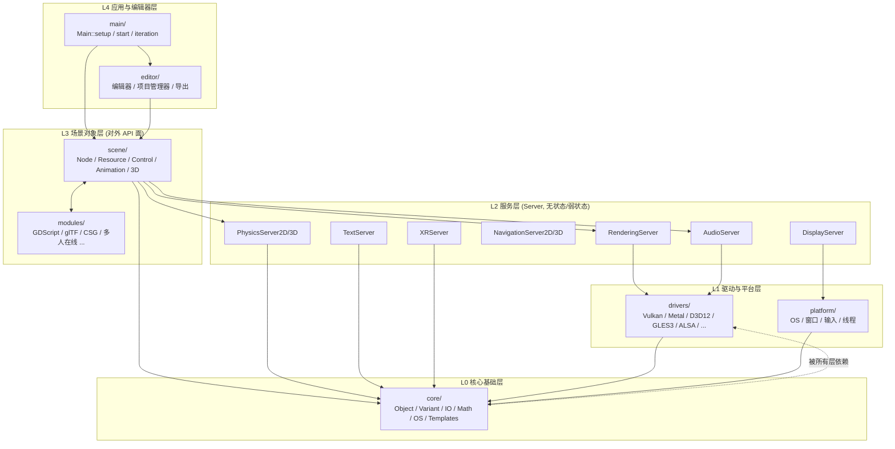
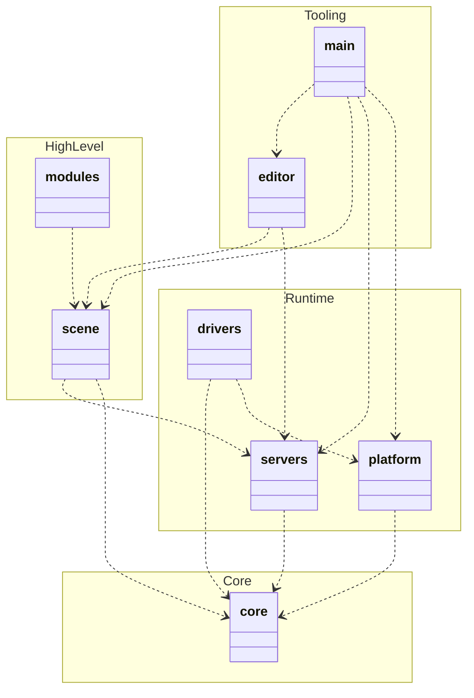
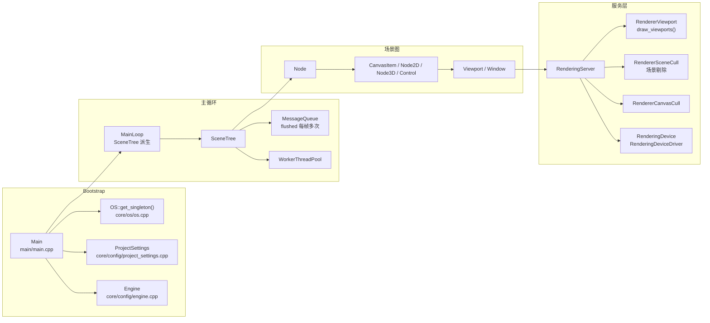
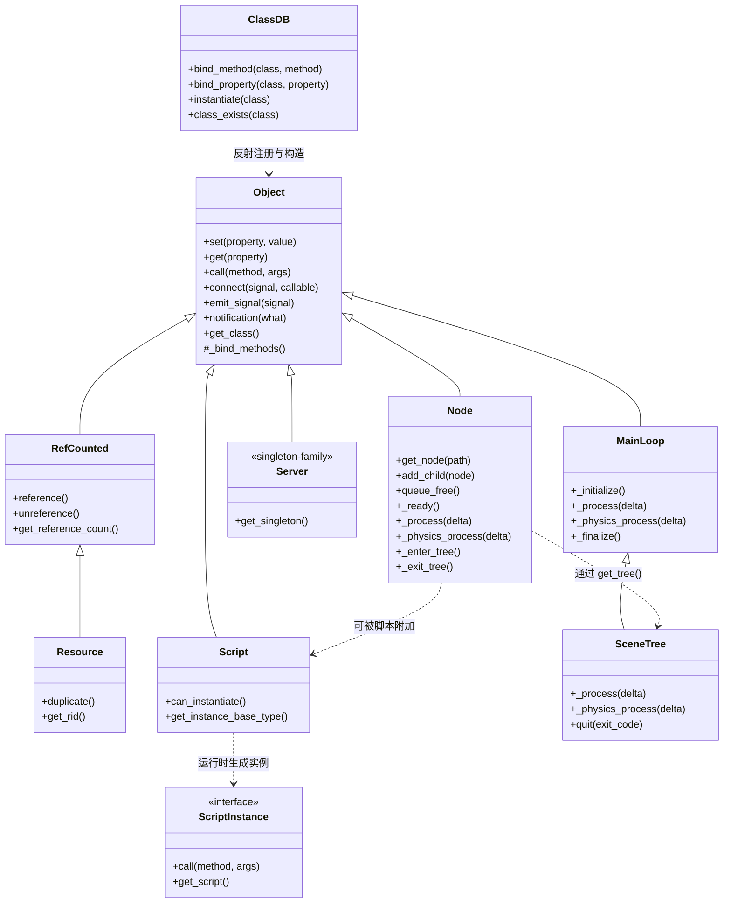
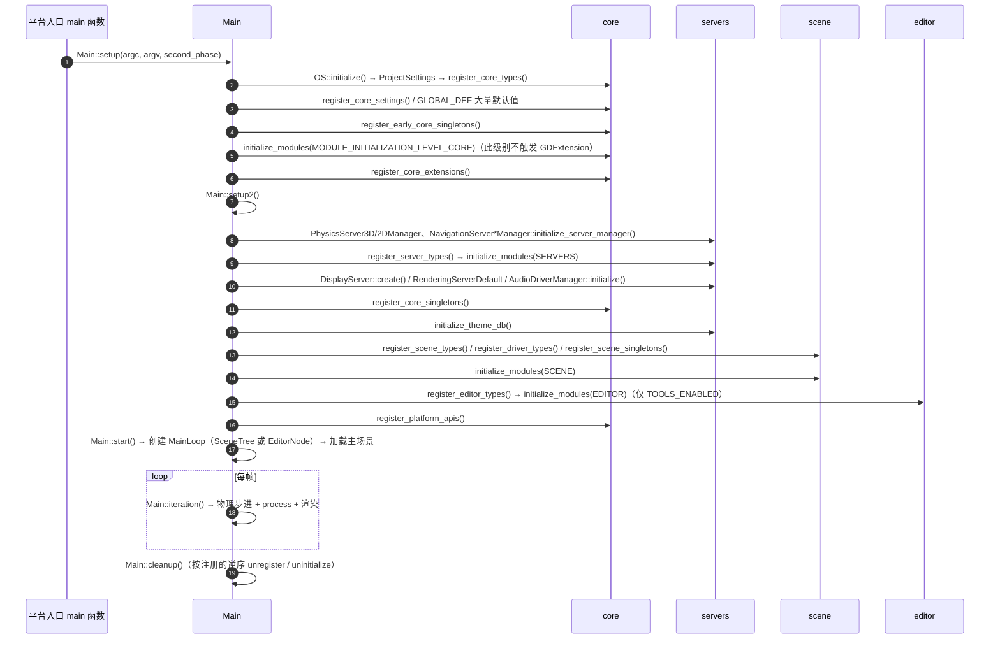

# 01 总体架构与 UML

## 1. 仓库坐标

| 项 | 值 |
| --- | --- |
| 版本 | `version.py` → `4.8.0.dev`(master 分支) |
| 主语言 | C++17(部分平台代码用 Objective-C++ / Java / Kotlin / Swift / JavaScript) |
| 构建系统 | SCons(`SConstruct` + `methods.py`) |
| 许可证 | MIT |
| 文档源 | `doc/classes/*.xml`(XML → reStructuredText → 官网) |

顶层共 12 个目录(11 个源码/工具目录 + `thirdparty/`),另加构建脚本与配置:

```
core/       core 基础库(对象模型/容器/IO/数学/OS 抽象)
servers/    服务层(渲染/物理/音频/导航/XR/文本/显示/相机/调试)
scene/      场景层(Node/Resource/GUI/2D/3D/动画)
drivers/    图形与音频驱动后端(Vulkan/Metal/D3D12/OpenGL/ALSA/...)
platform/   平台移植层(Windows/macOS/Linux/Android/iOS/visionOS/Web)
modules/    可裁剪的功能模块(GDScript/glTF/C#/物理后端/...)
editor/     编辑器(含项目管理器、导出)
main/       引擎宿主:启动流程与主循环
doc/        API 文档源与文档工具
tests/      单元测试(doctest)
misc/       构建脚本、图标、CI 辅助工具
thirdparty/ 第三方库(70 个)
```

---

## 2. 分层模型(UML 组件图)

Godot 的依赖方向是**单向向下**的,上层调用下层;下层通过**回调/信号/虚接口**向上通知。



**依赖要点**

- `core/` 不依赖任何上层,是唯一可以单独复用的部分;`core/object` 与 `core/variant` 是全局根。
- `servers/` 依赖 `core/` 与 `drivers/` 的**抽象接口**(`RenderingDeviceDriver`、`RenderingContextDriver`、
  `AudioDriver`),而不直接依赖具体图形 API。
- `scene/` 依赖 `servers/`,但**从不**直接调用 `drivers/`;所有 GPU 资源通过 `RenderingServer` 的 `RID` 访问。
- `editor/` 与 `scene/` 双向耦合(编辑器需要操作场景、场景提供编辑器扩展点),通过 `TOOLS_ENABLED` 隔离:
  发行版模板可裁剪掉整个 `editor/`。
- `modules/` 是横切层:每个模块可选择依赖 `core` / `servers` / `scene` / `editor` 四个初始化级别。

---

## 3. UML 包图(顶层包的依赖)



> 注:`drivers → platform` 指驱动使用平台的线程/窗口/文件抽象,而非反向。

---

## 4. UML 组件图(运行时关键组件)

这是一张「谁持有谁、谁调用谁」的运行期视图,是理解引擎最有用的一张图。



---

## 5. UML 类图(对象模型核心)

这是全项目最重要的抽象关系,读懂它等于读懂一半代码。



**四种「对象」的区别(常被混淆)**

| 类型 | 基类 | 生命周期 | 典型用途 |
| --- | --- | --- | --- |
| `Node` | `Object` | 手动/场景树管理,`queue_free()` 延迟释放 | 场景中的一切对象 |
| `Resource` | `RefCounted` | 引用计数,可自动释放 | 材质、纹理、动画、脚本 |
| `RefCounted` 自定义类 | `RefCounted` | 引用计数 | 工具类、数据类 |
| `Server` 单例 | `Object` | 进程级常驻 | 底层服务 |

**`RID` 是第五种东西**:它只是一个 64 位句柄结构体(`core/templates/rid.h`),不是 `Object` 的子类,
由 `RID_Owner<T>` 分配/校验。`Node`/`Resource` 持有 `RID`,服务端持有真实数据,这是「两态同步」
(如 `Node3D::set_transform` → `RenderingServer::instance_set_transform`)的根源。

---

## 6. Server 家族一览

| Server | 目录 | 后端实现 | 扩展方式 |
| --- | --- | --- | --- |
| `RenderingServer` | `servers/rendering/` | `RenderingServerDefault` → `RendererCompositorRD` / GLES3 / Dummy | `RendererCompositor` 子类(模块) |
| `PhysicsServer2D` | `servers/physics_2d/` | `PhysicsServer2DManager` 插件式(Godot Physics / Jolt) | 注册 `PhysicsServer2D` 子类 |
| `PhysicsServer3D` | `servers/physics_3d/` | 同上 | 同上 |
| `AudioServer` | `servers/audio/` | `AudioDriver` + `AudioEffect` 链 | 自定义 `AudioEffect` |
| `NavigationServer2D/3D` | `servers/navigation_2d|3d/` | 内建 A*/寻路 + `NavigationServer*Manager` | 注册后端 |
| `DisplayServer` | `servers/display/` | `platform/*` 各平台实现 | `DisplayServer::register_create_function` |
| `TextServer` | `servers/text/` | 扩展模块(`text_server_adv` / `text_server_fb`) | `TextServerExtension`(GDExtension 友好) |
| `XRServer` | `servers/xr/` | `XRInterface` 子类(OpenXR / WebXR) | 实现 `XRInterface` |
| `CameraServer` / `AccessibilityServer` / `MovieWriter` | `servers/*/` | 内建 / dummy | 部分支持扩展 |

共性设计:

- 单例通过 `Server::get_singleton()` 访问,`THREAD_SAFE` 场景下由 `*_wrap_mt`(如
  `PhysicsServer2DWrapMT`、`RenderingServerWrapMT`)把调用序列化为**命令队列**,主线程只写队列,
  服务线程执行,避免加锁。
- 所有服务都有一份 `*_dummy.h`(如 `physics_server_2d_dummy.h`、`display_server_headless.h`),
  用于 `--headless` 与「裁剪构建」。
- 服务的枚举与类型集中在 `*_types.h` / `*_enums.h`,与 `scene/` 层的常量一一映射,
  绑定脚本时用 `RSE::` / `PSE::` 命名空间别名转换。

---

## 7. 初始化顺序(启动与关闭)

这是 `main/main.cpp` 的真实顺序,理解它就能理解「谁可以依赖谁」。



关键点:

- **四段式初始化**由 `ModuleInitializationLevel` 定义(`modules/register_module_types.h`):
  `CORE → SERVERS → SCENE → EDITOR`,与 GDExtension 的 `GDEXTENSION_INITIALIZATION_*` 数值对齐,
  因此第三方扩展可以和内建模块在同一套时机里注册。
- 内建模块在每个 level 都调用 `initialize_modules(level)`;而
  `GDExtensionManager::initialize_extensions(level)` **只在 SERVERS / SCENE / EDITOR 三个级别**被调用
  (CORE 级别尚不具备动态扩展加载所需的基础设施)。
- 关闭顺序是初始化的**严格逆序**(见 `main/main.cpp:5288-5380` 一带)。
- `--headless` 时 `DisplayServer` 为 headless 实现;`DisplayServer::create()` 失败会逐后端回退。

---

## 8. 主要设计模式清单

| 模式 | 体现 | 位置 |
| --- | --- | --- |
| 单例 | `Engine`、`OS`、各 `*Server::get_singleton()` | `core/object`、`servers/*` |
| 抽象工厂 | `DisplayServer::create()`、`RenderingServerDefault` | `servers/display`、`servers/rendering` |
| 桥接/策略 | `*Server` ↔ `*WrapMT` ↔ `driver`/`rasterizer` | `servers/**/*_wrap_mt.*` |
| 组合 | `Node` 树、`AnimationNode` 树、`AudioEffect` 链 | `scene/main/node.cpp`、`scene/animation` |
| 观察者 | `connect()` / `emit_signal()` / `Callable` | `core/object/object.cpp` |
| 命令 + 延迟执行 | `MessageQueue`、`call_deferred`、`queue_redraw` | `core/object/message_queue.cpp` |
| 句柄/享元 | `RID`、`RID_Owner<T>` | `core/templates/rid_owner.h` |
| 写时复制 | `CowData`、`Vector`、`String` | `core/templates/cowdata.h` |
| 反射 | `ClassDB`、`MethodBind`、`PropertyInfo` | `core/object/class_db.cpp` |
| 访问者 | `*Extension` 类(如 `TextServerExtension`) | `servers/*/*_extension.*` |
| 原型 | `Resource::duplicate()`、`PackedScene` | `core/io/resource.cpp` |
| 脏标记 + 批处理 | `pending_update`、`flush_transform_notifications()` | `scene/main/scene_tree.cpp` |

---

## 9. 目录总览表(决策速查)

| 我想改…… | 去这里 | 归属团队(CODEOWNERS) |
| --- | --- | --- |
| 变体/数组/字典语义 | `core/variant/` | core |
| 对象、信号、反射 | `core/object/` | core |
| 文件/资源格式 | `core/io/` | core |
| 数学与几何 | `core/math/` | core |
| 线程、内存、时间 | `core/os/` | core |
| 渲染管线 / 着色器语言 | `servers/rendering/` | rendering |
| Vulkan/Metal/D3D12 后端 | `drivers/{vulkan,metal,d3d12}/` | rendering |
| OpenGL 兼容后端 | `drivers/gles3/` | rendering |
| 物理 | `servers/physics_2d|3d/`、`modules/{godot_physics_*,jolt_physics}/` | physics |
| 音频 | `servers/audio/`、`drivers/{alsa,pulseaudio,coreaudio,wasapi,xaudio2}/` | audio |
| 导航 | `servers/navigation_*`、`modules/navigation_*`、`scene/*/navigation*` | navigation |
| 节点/场景树 | `scene/main/` | core 或 scene |
| GUI 控件 | `scene/gui/`、`scene/theme/` | gui |
| 2D | `scene/2d/` | rendering/2D |
| 3D | `scene/3d/` | rendering/3D |
| 动画 | `scene/animation/`、`editor/animation/` | animation |
| 资源类型定义 | `scene/resources/` | core |
| 脚本语言 | `modules/gdscript/`、`modules/mono/` | gdscript / dotnet |
| 编辑器 UI | `editor/` | editor |
| 导出/打包 | `editor/export/` | export |
| 平台窗口/输入 | `platform/<platform>/` | platform |
| 构建配置 | `SConstruct`、`methods.py`、`*/SCsub` | buildsystem |
