# 03 主要功能流程

本篇只讲**主干链路**:每一步给出「谁调用谁」和「入口函数在哪」。细节留到各模块内部,但每条流程都保证
从头到尾可追踪,不出现「此处略」的断链。

## 0. 入口函数速查表

| 流程 | 入口 |
| --- | --- |
| 引擎启动 | 平台 `main()` → `Main::setup()` → `Main::setup2()` → `Main::start()` |
| 主循环 | `Main::iteration()`(`main/main.cpp:4917`) |
| 物理帧 | `SceneTree::physics_process()`(`scene/main/scene_tree.cpp:639`) |
| 逻辑帧 | `SceneTree::process()`(`scene/main/scene_tree.cpp:688`) |
| 渲染提交 | `RenderingServer::draw_viewports()` → `RendererViewport::draw_viewports()` |
| 资源加载 | `ResourceLoader::load()` → `ResourceLoader::_load()` |
| 资源导入 | `EditorFileSystem::scan()` → `ResourceImporter::import()` |
| 脚本编译 | `GDScriptLanguage::compile()` → `GDScriptParser` → `GDScriptAnalyzer` → `GDScriptCompiler` |
| 脚本执行 | `GDScriptFunction::call()` → `GDScriptVM` |
| 输入 | `DisplayServer::_dispatch_input_event()` → `Viewport::push_input()` → `Node::_input/_gui_input` |
| 音频混音 | `AudioDriver` 回调 → `AudioServer::_driver_process()` → `_mix_step()` |
| 导航查询 | `NavigationServer3D::map_get_path()` / `NavigationAgent3D` 内部查询 |
| 导出 | `EditorExportPlatform::export_project()` |
| 扩展加载 | `GDExtensionManager::load_extension()` → `initialize_extension()` |

---

## F1 引擎启动与初始化

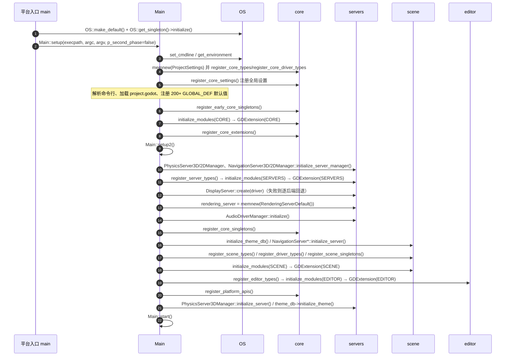

`Main::start()` 里的关键决策:

- `--editor` / `-p` / `--project-manager` → 创建 `EditorNode` 或 `ProjectManager` 作为 `MainLoop`;
- 否则创建 `SceneTree`,并 `load()` 主场景(`application/run/main_scene`)或 `--scene` 指定场景;
- 有 `-s/--script` 时创建 `SceneTree` 并挂载 `MainLoop` 脚本;
- 之后进入 `while (!exit) { Main::iteration(); }`。

**注意**:同一份顺序也以「简化版」出现在 `Main::test_setup()`(`main/main.cpp:686` 起),
它是单测环境的初始化,调试单测时可对照阅读。

---

## F2 主循环(帧流程)

一帧内可能包含 **0..N 次物理步进 + 1 次逻辑帧 + 1 次渲染**。`physics/common/max_physics_steps_per_frame`
默认 8,`physics_ticks_per_second` 默认 60;`physics_jitter_fix` 用于抑制抖动。

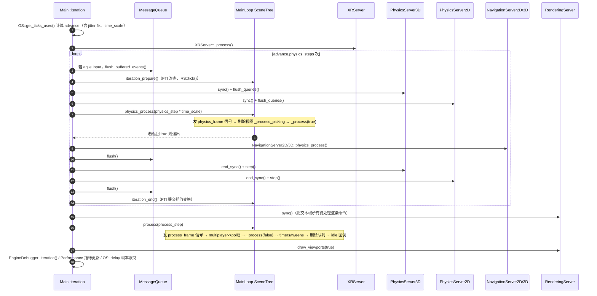

要点:

- **物理与逻辑分离**:`_physics_process` 只在物理步进里跑,`_process` 每逻辑帧跑一次;两者之间通过
  `physics_interpolation`(FTI)或节点自己的插值做视觉平滑。
- **`MessageQueue` 是本帧的「命令总线」**:`call_deferred`、`queue_free`、`queue_redraw` 都排队,
  在固定位置成批 flush,因此**释放是延迟的**(`_flush_delete_queue` 在帧末)。
- **`_process` 里创建的节点不会立刻进入树**,`add_child` 的 `_enter_tree` 通知在合适时机统一发出。
- 渲染线程模型见 `04` 的「线程模型」;`RenderingServer::sync()` 是主线程与渲染线程的交汇点。

---

## F3 节点生命周期与通知传播

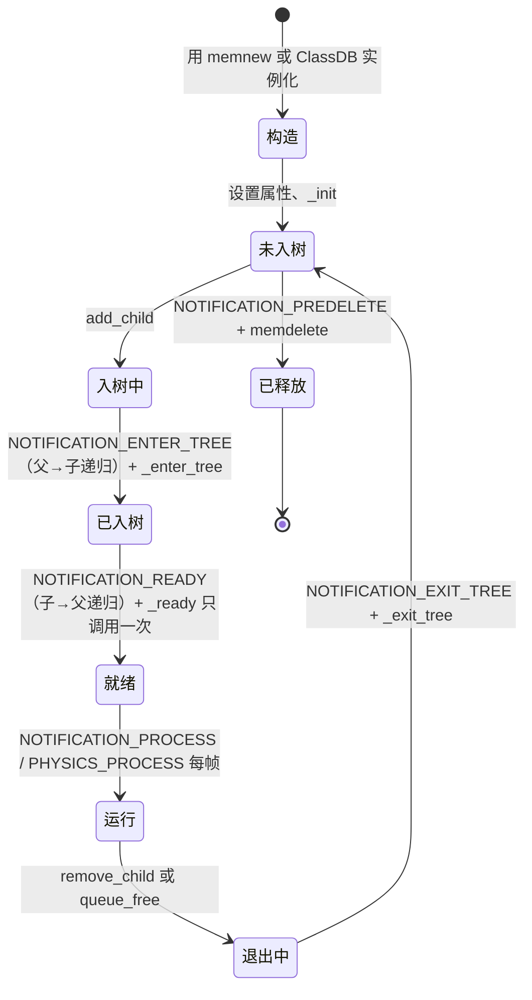

传播规则(容易搞反,务必记住):

| 通知 | 传播方向 | 触发时机 |
| --- | --- | --- |
| `NOTIFICATION_ENTER_TREE` / `_enter_tree` | **父 → 子** | `add_child` 后,`_ready` 前 |
| `NOTIFICATION_EXIT_TREE` / `_exit_tree` | **父 → 子** | 移除时 |
| `NOTIFICATION_READY` / `_ready` | **子 → 父** | 子树全部入树后,每节点仅一次 |
| `NOTIFICATION_PROCESS` | 逐节点 | 在 `_process` 回调前由 `SceneTree::_process` 触发 |
| `NOTIFICATION_PHYSICS_PROCESS` | 逐节点 | 物理帧 |
| `NOTIFICATION_PREDELETE` | 逐节点 | `memdelete` 前 |

- 顺序控制:同一父节点下按子节点顺序与 `process_priority`、`process_physics_priority` 排序;
- `set_process(false)` 只是不再调用回调,节点仍在树上;
- `queue_free()` 只是把释放请求投递到 `SceneTree` 的删除队列,帧末统一执行;
- 分组(group)是另一条广播通道:`call_group` / `notify_group` / `set_group`,内部有 `SceneTreeGroup` 加速。

相关文件:`scene/main/node.cpp`、`scene/main/scene_tree.cpp`。

---

## F4 资源加载(运行时)

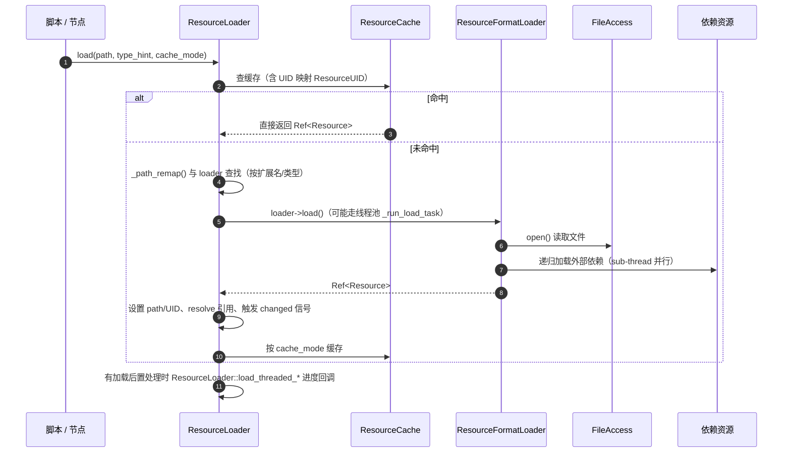

- 加载模式 `CacheMode`:`CACHE_MODE_IGNORE` / `REUSE` / `REPLACE` / `IGNORE_DEEP` 等,决定了缓存与
  「同一路径多实例」的行为,这是排查「资源被重复加载」问题的关键。
- 线程化加载:`load_threaded_request()` → 后台 `_run_load_task` → `load_threaded_get_status()` 轮询,
  场景切换常用它做加载画面。
- 打包后:`FileAccessPack` 让路径透明地落到 PCK 中,`FileAccess` 层无感知。
- 编辑器额外有 `RemoteFilesystemClient`,让运行实例从编辑器进程拉取资源(用于「远程调试」)。

相关文件:`core/io/resource_loader.cpp`、`core/io/resource.cpp`、`core/io/resource_format_binary.cpp`。

---

## F5 资源导入(编辑器)

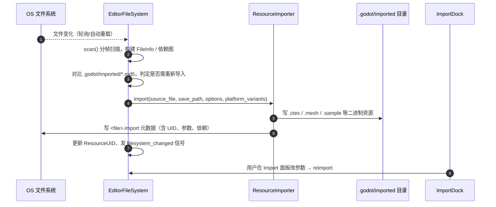

- 导入器是**插件式**的:`EditorImportPlugin` / `ResourceImporter` 子类,通过 `add_import_plugin` 注册;
  3D 场景导入还有「后置导入插件」(`EditorScenePostImport`)供项目自定义。
- 导入产物与源文件分离,因此**替换同路径源文件会触发重新导入**,而运行时只读导入产物。
- 平台变体(如纹理压缩格式)由 `platform_variants` 支持,导出时按目标平台挑选。

相关文件:`editor/file_system/editor_file_system.cpp`、`editor/import/resource_importer.cpp`。

---

## F6 渲染流程

### F6.1 2D 渲染

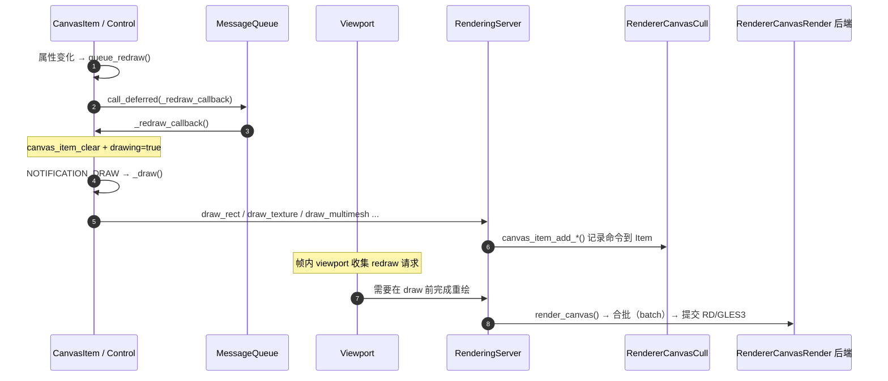

要点:

- `queue_redraw` **不是立即绘制**,而是把「重绘」推迟到 `MessageQueue` flush 时执行 `_draw`,
  因此在 `_draw` 之外调用绘制 API 会报错(见 `canvas_item.cpp:56` 的断言)。
- 2D 命令在 `RendererCanvasCull` 中按材质/纹理/混合模式**排序与合批**,`draw_index`、`z_index`、
  `CanvasLayer` 决定绘制顺序。
- 后端两条路:`RendererCanvasRenderRD`(forward+ / mobile)与 `RasterizerCanvasGLES3`(gl_compatibility)。

### F6.2 3D 渲染

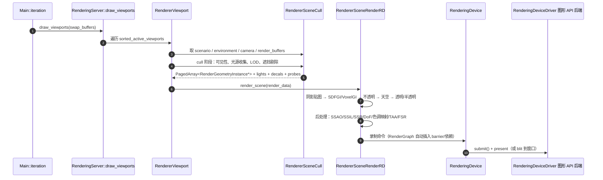

要点:

- **剔除与渲染分离**:`RendererSceneCull` 维护实例/光源/探针的注册表并产出本帧的 `PagedArray`,
  真正绘制由 `RendererSceneRenderRD` 完成;`Dummy` 后端把两者都换成空实现。
- **`RenderingDevice` 是 GPU 抽象层**:`RenderingDeviceDriver` 有两个实现族——图形 API 后端
  (`vulkan/metal/d3d12`)与不可用的 `dummy`。RD 层负责资源、命令缓冲、屏障、管线缓存。
- **`forward_plus` vs `mobile` vs `gl_compatibility`**:前两者共享 RD 与大部分存储层,差异在
  `forward_clustered/` 与 `forward_mobile/` 的场景渲染实现;`gl_compatibility` 走 GLES3 独立路径。
- 渲染线程开启时(`rendering/driver/threads/thread_model`),`RenderingServerWrapMT` 把命令写入
  `CommandQueueMT`,`RenderingServer::sync()` 是唯一的同步点。

---

## F7 物理流程

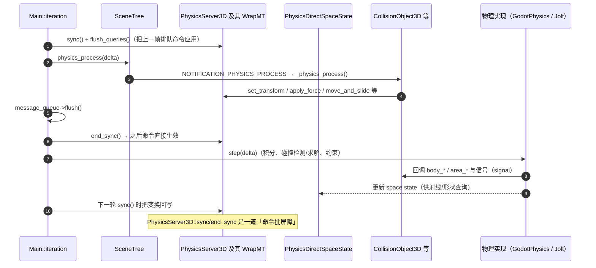

要点:

- **`sync/flush_queries/end_sync/step` 四段式**是理解物理线程安全的关键:它们在物理步进内按序调用
  (`main/main.cpp:4965-5046`)。
- `move_and_slide()` 由 `CharacterBody3D` 在 `_physics_process` 中调用,内部使用
  `PhysicsDirectBodyState` + `KinematicCollision` 做滑动求解。
- 查询 API(`intersect_ray`、`intersect_shape`、`cast_motion`)通过 `PhysicsDirectSpaceState3D` 暴露,
  **必须在物理帧内使用**。
- 后端可替换:`godot_physics_3d` / `jolt_physics`,通过 `PhysicsServer3DManager::set_default_server`
  与项目设置 `physics/3d/physics_engine` 选择。
- 物理插值:开启 FTI 后 `SceneTree::client_physics_interpolation_*` 负责在物理步与渲染帧之间插值。

---

## F8 GDScript 编译与执行

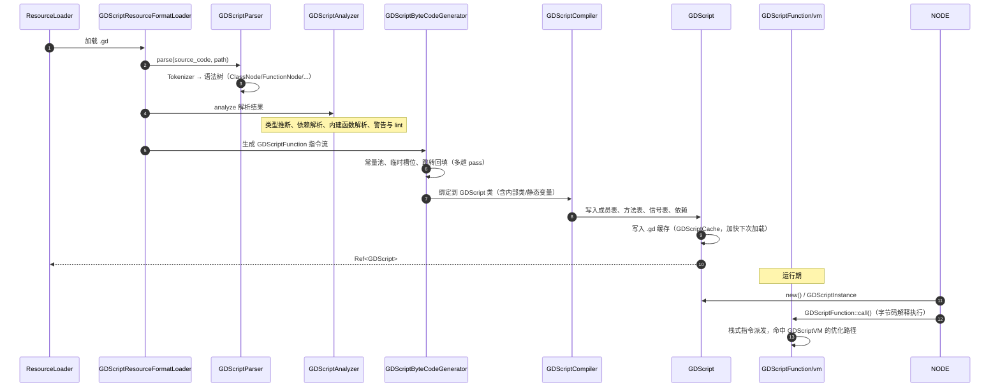

要点:

- 前端三件套 `Tokenizer → Parser → Analyzer`,后端 `ByteCodeGenerator → Compiler → VM`,中间产物是
  **字节码**(不是原生代码),因此运行时是解释执行。
- 静态类型信息在分析阶段确定,支持可选类型标注;`gdscript_warning` / `gdscript_linter` 服务于编辑器提示。
- `modules/gdscript/language_server/` 提供 LSP,`gdscript_cache` 提供跨脚本缓存与循环依赖处理。
- C# 走完全不同的路径(`modules/mono/`):编译为 IL,由 .NET 运行时托管,`ManagedCallable` 桥接回调。

---

## F9 输入事件流程

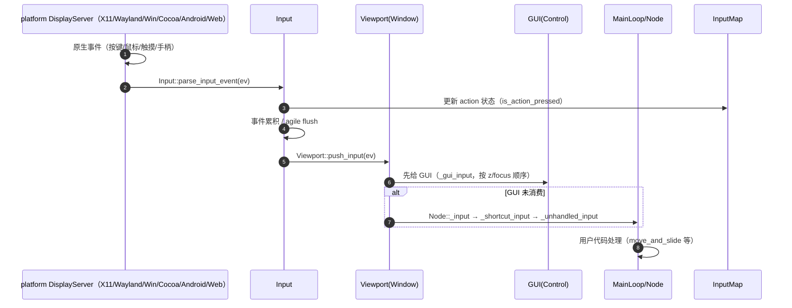

要点:

- 事件有三个「用户可介入层」:`_input`(最早) → `_gui_input`(Control 专属) → `_unhandled_input`(最后),
  另有 `_shortcut_input`(菜单快捷键)与 `_unhandled_key_input`。
- `set_input_as_handled()` 阻止继续向下传播;正确使用它是避免「输入穿透」的关键。
- `Input` 还维护**状态缓存**(`is_action_pressed`、鼠标位置、摇杆轴),与事件流是两套并行的机制。
- `InputEventScreenTouch/Drag` 经 `Viewport` 的 `physics_object_picking` 转换为 2D/3D 拾取;拾取在物理帧
  里的 `_process_picking` 执行。
- 手柄映射表在构建期由 `input_builders.py` 生成,来源是 `gamecontrollerdb.txt` / `godotcontrollerdb.txt`。

---

## F10 音频流程

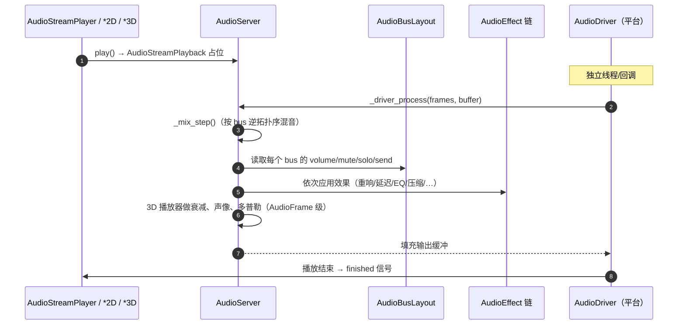

要点:

- 混音在**音频驱动线程**上跑,与主线程通过无锁队列/原子量通信;因此 `AudioServer` 的多数 API 是
  线程安全的,但**不要在音频回调里做重活**。
- 总线是 DAG(`bus_send`),`_mix_step` 按逆拓扑序计算,`AudioEffect` 按链式顺序串接。
- 3D 空间化参数(距离衰减、声像、混响区域、多普勒)由 `AudioStreamPlayer3D` 每帧更新到
  `AudioServer` 的 playback 上。
- 解码器以模块形式提供(`ogg/vorbis/mp3/theora`),`AudioStream` 的实现决定是否需要提前解码。

---

## F11 导航流程

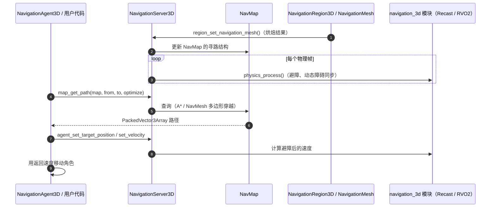

要点:

- 导航服务的更新跑在**物理帧**(`NavigationServer3D::physics_process`,见 `main/main.cpp:5018`),
  因此注册/更新区域的生效时机是下一个物理帧。
- 服务层只做图与查询,网格生成在 `modules/navigation_3d`(Recast),避障用 `rvo2`。
- 场景节点 `NavigationAgent3D` 只是服务层的薄封装,它的 `velocity_computed` 信号是给用户接移动逻辑的。

---

## F12 编辑器启动与运行/调试

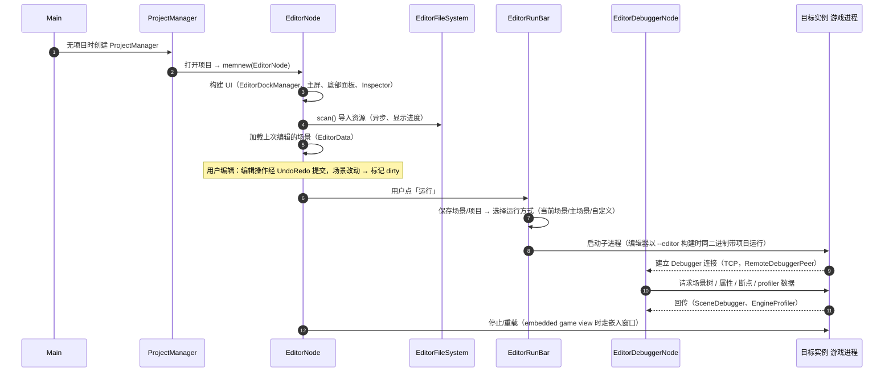

要点:

- 编辑器本身就是一个运行在 `SceneTree` 之上的应用:`EditorNode` 继承自 `Node`(经由 `MainLoop` 包装),
  `TOOLS_ENABLED` 宏决定它是否被编译进来。
- **编辑器的「编辑场景」也走 `Viewport` 与 `RenderingServer`**,只是相机与 gizmo 由编辑器插件绘制;
  这就是为什么 `editor/scene/3d/node_3d_editor_gizmos.cpp` 会直接调渲染 API。
- 所有编辑操作必须经 `EditorUndoRedoManager`,否则撤销栈会错乱。
- 运行时的**远程调试**共用 `core/debugger` 协议;`editor/debugger/debug_adapter` 额外实现 DAP,
  让外部 IDE 可以调试。
- 嵌入游戏窗口(`embedded_process.cpp` + `game_view_plugin.cpp`)让游戏渲染到编辑器内的子窗口,
  依赖 `DisplayServer` 的 `FEATURE_SUBWINDOWS` 或嵌入父窗口能力。

---

## F13 导出流程

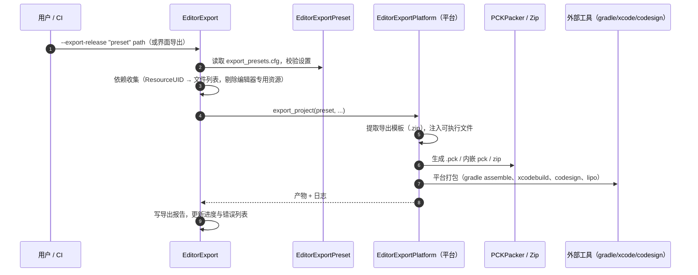

要点:

- 导出模板由 `export_template_manager` 下载/管理,版本必须与编辑器严格匹配。
- `EditorExportPlatform` 有多个特化:`PC`、`AppleEmbedded`、Android、Web、dedicated server;各平台自己的
  细节在 `platform/
/export/`。
- 资源筛选逻辑(`EditorExport::_export_customize` / 依赖收集)决定哪些文件进包,以及是否生成
  `.godot/exported/` 缓存;这是「导出产物比预期大/小」问题的排查点。
- 着色器可预烘焙(`editor/shader/shader_baker/`),减少首次运行卡顿。
- `--export-pack` 只产数据包,`--export-patch` 产增量包(配合 `FileAccessPatched`)。

---

## F14 GDExtension 与模块加载

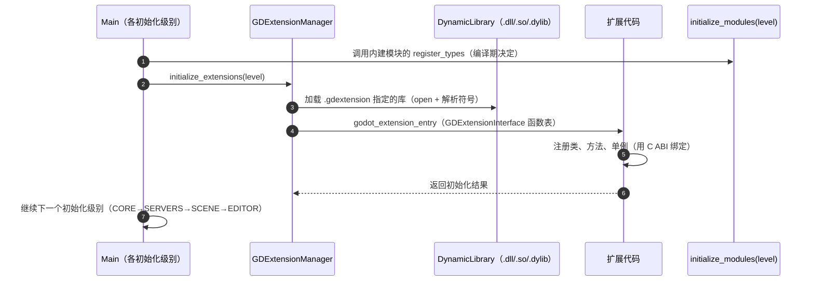

要点:

- **内建模块与 GDExtension 使用同一套初始化级别和时间点**,`ModuleInitializationLevel` 的数值与
  `GDEXTENSION_INITIALIZATION_*` 对齐(`modules/register_module_types.h`)。
- 动态库入口有多个:`godot_*_entry` 家族与兼容旧 ABI 的 `godot_gdnative_*`;`gdextension_special_compat_hashes.cpp`
  处理历史版本的方法哈希兼容。
- 扩展只能通过 C ABI 访问引擎,**没有 C++ ABI 兼容性保证**;`--dump-extension-api` 生成的
  `extension_api.json` 是绑定的真源,`--validate-extension-api` 在 CI 中做兼容性校验。
- 模块的开关在构建期由 `modules/*/config.py` 的 `can_build()` 与 SCons 选项决定,
  `modules_enabled.gen.h` 生成 `MODULE_X_ENABLED` 宏。

---

## F15 关闭与清理

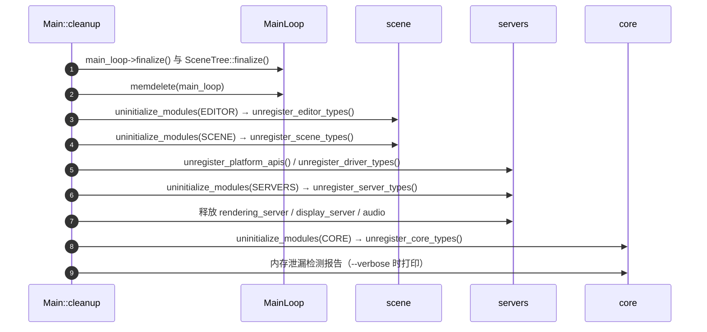

要点:

- 关闭是初始化的**严格逆序**;顺序错误会导致「析构时访问已释放单例」的崩溃。
- `SceneTree::finalize()` 会移除所有节点并发出退出通知,`Node::_exit_tree` 与
  `NOTIFICATION_PREDELETE` 是清理 `RID` 的最后机会。
- 编辑器还会额外做:关闭未保存场景提示、缓存落盘、远程调试断开。
